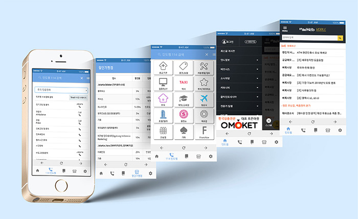

<!--  -->
<!-- 🔭 I’m currently working on [my portfolio](https://minhee88.github.io/guerlain)
📫 How to reach me **extrnzoe@gmail.com** ### 💪 Skills-->
<h1>  디자인을 이해하는 웹퍼블리셔, 백민희 입니다 
</h1>
  

### ⚡Tech 


### 👀 I'm practicing


### ⚡Status  

> <a href="https://github.com/minhee88" target="_blank">https://github.com/minhee88</a>
<br/>  

## Who am I?
``` js
class WhoAmI = {

    name: "백민희",
    email: "extrnzoe@gmail.com",
    locate: "Incheon Korea",
    skill: ["HTML", "CSS", "Javascript", "Git", "Github"],
    update: "2025-02-21"

};
```
<br>       

### ⚡Project Career (Web designer)





<br>
<!-- <p></p> -->


<details open>
  <summary>⚡Career List </summary>
  <br>
 
| Date | Korean Name | English Name |
| :---: | :--- | :--- |
| 2025-02 ~ | 웹퍼블리셔 | Web Publisher |
| 2018-11 ~ 2023-06 | 코윈스블루 웹디자이너 | KowinsBlue Web Designer |
  
</details>
